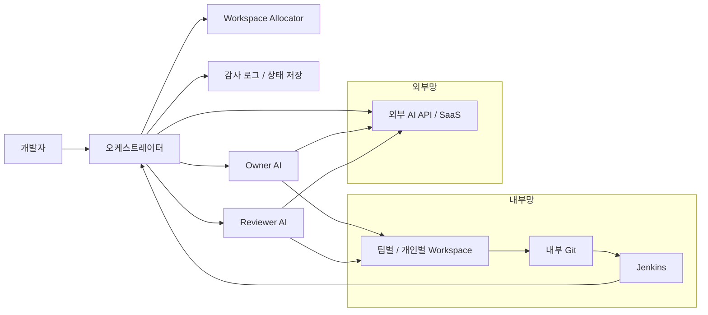
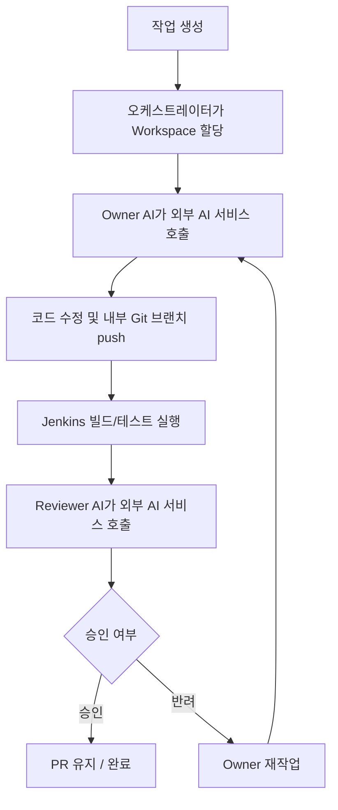
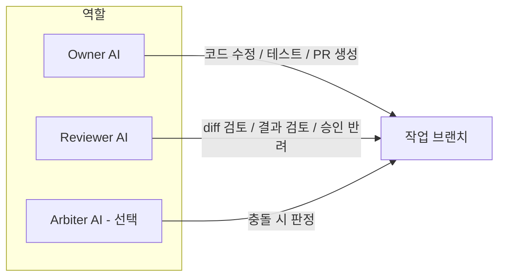

# 외부망 연계 AI 개발지원 시스템 구축 검토안

## 1. 시스템 소개

본 검토안은 **내부 Git/Jenkins는 유지하되, AI 모델은 외부망 API 또는 외부 서비스와 연계**하여 사용하는 개발지원 시스템 구축 제안입니다.

구성 개념:
- **Owner AI**: 코드 수정, 테스트 실행, PR 생성 지원
- **Reviewer AI**: 변경사항 검토, 테스트 결과 확인, 승인/반려 판단 지원
- **Orchestrator**: 작업 배정, workspace 할당, 상태 관리, 감사 로그 저장
- **내부 Git / Jenkins 연동**: branch/PR 기준 빌드 및 테스트 자동화
- **외부 AI 서비스 연계**: OpenAI API, GitHub Copilot Business 등 외부 서비스 활용 가능

운영 전제:
- 내부 Git/Jenkins는 사내에 유지
- AI 관련 요청만 외부망 연동
- 소스 전송 범위 및 로그 저장 범위는 별도 정책 필요

---

## 2. 시스템 시각화

### 2-1. 전체 구성도

### 2-2. 실제 동작 흐름

### 2-3. 역할 분리 구조

---

## 3. 예상 비용

### 3-1. 초기 구축비(1회)

| 항목 | 권장 구성 | 예상 비용 |
|---|---|---:|
| CPU 서버 | 내부 Git + Jenkins Controller + Orchestrator 운영용 | 700만 ~ 1,500만원 |
| 스토리지/백업 | NAS, 백업 스토리지, UPS 등 | 300만 ~ 800만원 |
| 구축 인건비 | MVP 2~4주, 연동/운영 화면 포함 | 1,500만 ~ 3,000만원 |
| **총 초기 구축비** | **외부망 연계형 기준** | **2,500만 ~ 5,300만원** |

### 3-2. 소프트웨어/라이선스 비용

| 항목 | 비용 | 비고 |
|---|---:|---|
| Jenkins | 0원 | 오픈소스 |
| 내부 Git (Gitea Self-Managed) | 0원 | 오픈소스 self-hosted |
| 내부 Git (GitLab Self-Managed Free) | 0원부터 | Free 가능, Premium/Ultimate는 별도 좌석 과금 |
| GitHub Copilot Business | **$19 / 사용자 / 월** | 공식 좌석 과금 |
| OpenAI API (GPT-5.4) | 입력 **$2.50 / 1M tokens**, 출력 **$15 / 1M tokens** | 공식 사용량 과금 |

### 3-3. 월간 운영비

| 구분 | 예상 비용 |
|---|---:|
| 인프라 운영비 | 50만 ~ 120만원/월 |
| 운영 인력 일부 포함 시 | 200만 ~ 500만원/월 |
| 외부 AI 사용료 | 사용량/좌석 수에 따라 별도 |

### 3-4. 연간 운영비

| 구분 | 예상 비용 |
|---|---:|
| 인프라 운영비 | 600만 ~ 1,440만원/년 |
| 운영 인력 일부 포함 시 | 2,400만 ~ 6,000만원/년 |
| 외부 AI 사용료 | 사용량/좌석 수에 따라 별도 |

### 3-5. 세부 견적 예시

| 항목 | 수량 | 단가(예상) | 합계(예상) | 비고 |
|---|---:|---:|---:|---|
| CPU 서버 | 1 | 700만 ~ 1,500만원 | 700만 ~ 1,500만원 | Git + Jenkins + Orchestrator |
| NAS/백업 스토리지 | 1식 | 200만 ~ 500만원 | 200만 ~ 500만원 | 백업/감사 로그 저장 |
| UPS | 1식 | 100만 ~ 300만원 | 100만 ~ 300만원 | 정전 보호 |
| 네트워크/부대자재 | 1식 | 50만 ~ 200만원 | 50만 ~ 200만원 | 방화벽 정책, 케이블, 자재 |
| 구축 인건비 | 1식 | 1,500만 ~ 3,000만원 | 1,500만 ~ 3,000만원 | MVP 2~4주 기준 |
| **총합** |  |  | **2,550만 ~ 5,500만원** | 세부 견적 합산 예시 |

### 3-6. 외부 AI 사용료 예시

#### 좌석형 예시
- **GitHub Copilot Business**: 공식 가격 **$19 / 사용자 / 월**
- 예시: 50명 기준 **$950 / 월**, **$11,400 / 년** + 환율/세금 별도

#### 사용량형 예시
- **OpenAI GPT-5.4 공식 가격**
  - 입력: **$2.50 / 1M tokens**
  - 출력: **$15.00 / 1M tokens**
- 예시: 월 **100M input + 20M output** 사용 시
  - 입력 비용: **$250 / 월**
  - 출력 비용: **$300 / 월**
  - 합계: **$550 / 월**, **$6,600 / 년** + 환율/세금 별도

권장안:
- 초기 비용을 줄이려면 **외부망 연계형**이 유리
- 대신 외부 AI 사용료가 매월 발생
- 보안/계약/데이터 반출 통제가 가능한 경우에만 적합

---

## 4. 구축 방법

### 단계별 구축

#### 1단계: Reviewer 우선 도입
- diff 읽기
- 테스트 실행
- 리뷰 결과 생성
- 외부 AI API 연동

#### 2단계: Owner 기능 추가
- 작업 브랜치 수정
- 테스트 실행
- PR 생성

#### 3단계: 승인/반려 루프 구축
- Owner 작업 -> Reviewer 검토 -> 승인/반려
- 재작업 자동화

#### 4단계: 확대 적용
- 팀별 workspace 분리
- 여러 저장소 확장
- 필요 시 Arbiter AI 도입

---

## 5. 장점

- 초기 인프라 비용이 폐쇄망 GPU 서버 방식보다 낮음
- GPU 서버 없이도 시작 가능
- 최신 상용 모델을 바로 활용 가능
- 도입 속도가 빠름
- 운영 난이도가 상대적으로 낮음

---

## 6. 단점 및 리스크

- 소스/로그 일부가 외부 AI 서비스로 전송될 수 있음
- 계약/보안/개인정보/반출 통제 검토 필요
- API 사용량 증가 시 월 비용이 지속적으로 증가
- 외부 서비스 장애 시 업무 영향 가능
- AI 결과를 사람이 최종 검토해야 함

### 대응 방안
- 전송 가능한 데이터 범위 문서화
- 민감 저장소 제외 정책 적용
- branch/PR 기반 운영
- Jenkins 결과 없는 완료 금지
- 작업 이력/승인 이력 전부 기록
- 외부 AI 장애 시 Reviewer-only 또는 수동 모드 fallback 준비

---

## 7. 어떻게 사용하는지

1. 개발자가 작업 생성
2. 시스템이 workspace 할당
3. Owner AI가 외부 AI 서비스 호출 후 코드 수정 및 테스트 수행
4. Jenkins가 빌드/테스트 실행
5. Reviewer AI가 외부 AI 서비스 호출 후 결과 검토
6. 승인 시 PR 유지, 반려 시 재작업

즉, 개발자를 대체하는 구조가 아니라  
**개발자의 반복 작업을 줄이고 검토 보조를 제공하는 구조**로 운영합니다.

---

## 8. 필요한 장비

### 최소 권장 장비
- **CPU 서버 1대**
  - 내부 Git 서버
  - Jenkins Controller
  - 오케스트레이터 운영
- NAS 또는 백업 스토리지
- UPS
- 외부 AI API 사용 가능한 네트워크 정책

### 권장 운영 장비 구성
- **CPU 서버 1대 + 내부 백업 장비**
- 팀 1개 / 저장소 1개 MVP 운영 가능 수준
- 외부 AI 연동을 위한 방화벽/프록시 정책 필요

### 운영 환경
- 내부 Git/Jenkins 유지
- 외부 AI 서비스 호출 가능 환경
- 작업/로그/승인 이력 저장용 서버 또는 DB

---

## 9. PPT 1장 발표용 요약 문구

### 제목
외부망 연계 AI 개발지원 시스템 구축 검토안

### 배경
- 반복적인 코드 리뷰, 테스트 확인, 브랜치 작업 부담 증가
- GPU 서버 기반 내부 AI보다 빠른 도입 가능
- 외부 상용 AI 활용 시 최신 모델 접근 가능

### 제안 내용
- Owner AI: 코드 수정 / 테스트 / PR 생성 지원
- Reviewer AI: 변경사항 검토 / 승인·반려 판단 지원
- 내부 Git / Jenkins 연동
- 외부 AI API 또는 SaaS 연계

### 기대 효과
- 초기 구축비 절감
- 도입 속도 향상
- 최신 모델 활용 가능

### 비용
- 초기 구축비: **2,500만 ~ 5,300만원**
- 월간 인프라 운영비: **50만 ~ 120만원**
- 외부 AI 사용료: **좌석형 또는 사용량형 별도**

### 제안
- CPU 서버 1대 + 내부 Git/Jenkins 유지
- 저장소 1개, 팀 1개 기준 MVP부터 단계 도입 검토
- 데이터 반출 범위 통제 정책을 전제로 진행

### 회의용 한 줄
외부망 연계형은 초기 구축비가 낮고 빠르게 도입할 수 있지만, **외부 AI 사용료와 소스 전송 범위 통제**가 핵심 조건입니다.

---

## 10. 추진 일정표

### 2주 MVP 일정표

| 주차 | 작업 내용 | 산출물 |
|---|---|---|
| 1주차 | CPU 서버 준비, Git/Jenkins 연동, 외부 AI API 연결, Reviewer 기능 구현 | 리뷰 결과 생성 가능 |
| 2주차 | Owner 기능 추가, branch 작업, PR 생성, 승인/반려 루프 연결 | 저장소 1개 기준 MVP 동작 |

### 4주 확장 일정표

| 주차 | 작업 내용 | 산출물 |
|---|---|---|
| 1주차 | CPU 서버/네트워크 정책 정리, Git/Jenkins 연동 | 기본 인프라 준비 |
| 2주차 | Reviewer 도입, diff/test 기반 리뷰 | Reviewer MVP |
| 3주차 | Owner 도입, branch 수정/test/push/PR 생성 | Owner MVP |
| 4주차 | workspace allocator, 감사 로그, 운영 화면 정리 | 팀 단위 시범 운영 가능 |

---

## 11. 요청 사항

- 외부망 연계 AI 개발지원 시스템 구축 가능 여부 검토
- CPU 서버 1대 기준 예산 검토
- 저장소 1개 / 팀 1개 기준 MVP 시범 도입 검토
- 외부 AI 서비스 계약/연동 방식 협의
- 데이터 전송 범위 및 운영 주체 지정

---

## 12. AI 모델/서비스 비교

| 구분 | 장점 | 단점 | 외부망 연계 적합성 | 권장 용도 |
|---|---|---|---|---|
| **Claude 계열** | 코드 리뷰/수정 품질이 높고 Owner/Reviewer 구조와 궁합이 좋음 | 완전 폐쇄망 직접 설치는 어렵고 관리형 경로 의존 | **높음** | 코드 리뷰, 패치 초안, 문서/규정 해설 |
| **GPT 계열** | 범용 추론, 도구 사용, 코드 생성 품질이 높음 | 사용량 과금과 데이터 전송 범위 통제가 필요 | **높음** | 범용 Owner/Reviewer, 자동화 워크플로우 |
| **Gemini 계열** | 긴 컨텍스트와 Google 생태계 연동 강점 | Vertex/Google 기반 운영 전제가 강함 | **높음** | 긴 문서/규격 참조형 작업 |
| **GitHub Copilot Business** | 도입이 빠르고 IDE 친화적 | Owner/Reviewer/Orchestrator 구조를 그대로 만들기엔 한계 | **중간** | 개발자 개인 보조, 코드 제안 |

현재 목표가 **"이곳과 유사한 Owner / Reviewer 협업 구조"**라면, 외부망 연계형에서는 **Claude / GPT 계열 관리형 모델이 가장 현실적**입니다.

---

## 13. "이곳과 동일한 수준" 구축 가능성

외부망 연계형은 폐쇄망보다 **현재 이곳과 가장 유사한 수준으로 접근 가능한 방식**입니다.

### 가능한 것
- Owner / Reviewer / Orchestrator 구조
- 코드 수정 -> PR 생성 -> 리뷰 루프
- 내부 Git / Jenkins 연동
- 고성능 상용 모델 사용

### 여전히 다른 점
- 모델 API 비용이 지속적으로 발생함
- 데이터 전송 범위 통제 정책이 필요함
- 서비스 장애나 정책 변경 영향을 받음

즉,
- **구조는 거의 유사하게 구현 가능**
- **모델 품질도 폐쇄망형보다 훨씬 가깝게 맞출 수 있음**
- 다만 보안/비용/통제 측면의 부담이 커집니다.

---

## 14. 권장 첫 번째 성공 사례

외부망 연계형에서도 첫 유즈케이스는 **Reviewer 중심**이 가장 안전합니다.

### 권장 1차 유즈케이스
- 입력: PR diff, 테스트 결과, 정적분석 결과
- 출력:
  - 원인 설명
  - 수정 가이드
  - 패치 초안
  - 승인/반려 의견

### 이유
- 자동 merge보다 안전함
- 품질 평가가 쉬움
- 도입 초기에 신뢰를 쌓기 좋음
- 이후 Owner 자동화로 확장하기 쉬움

---

## 15. 결론

외부망 연계형 AI 개발지원 시스템은  
**초기 구축비를 낮추고 빠르게 MVP를 시작할 수 있는 방식**입니다.

다만 운영 시에는,
- 외부 AI 사용료
- 데이터 반출 범위 통제
- 외부 서비스 의존성

을 함께 관리해야 합니다.

즉,
- **초기 비용과 도입 속도가 중요하면 외부망 연계형**
- **보안 통제와 내부 독립성이 중요하면 폐쇄망 내부형**

으로 구분해서 판단하는 것이 적절합니다.

