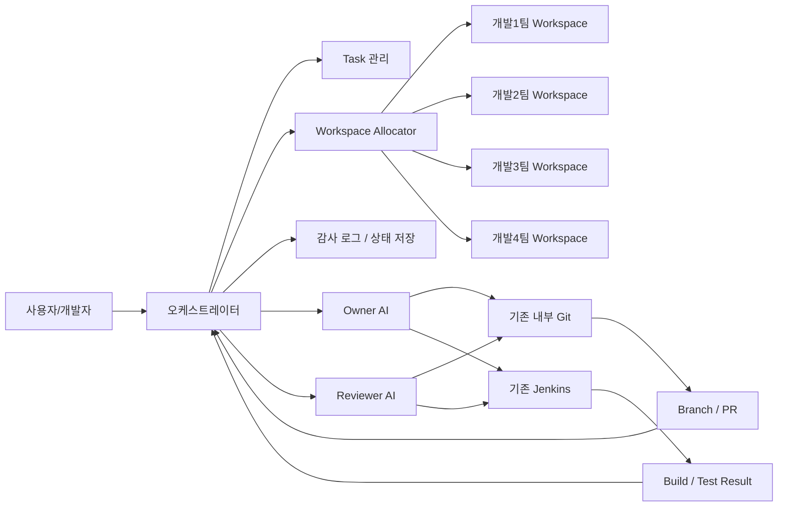
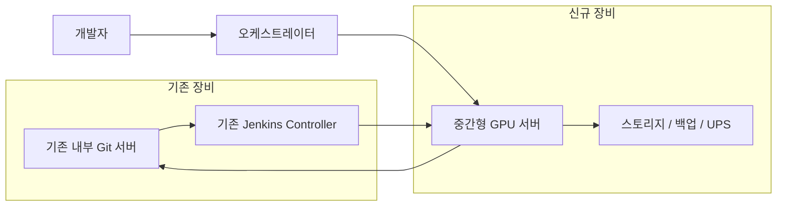
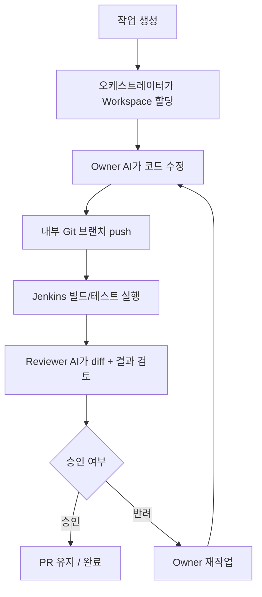
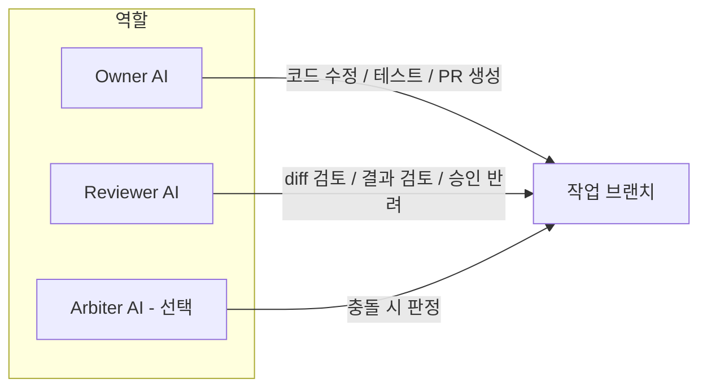

# 사내 AI 구축안 비교 검토안

## 1. 문서 개요

본 문서는 사내 개발지원용 AI를 구축하는 방법을 아래 3가지로 나누어 비교하는 검토안입니다.

- **완전 폐쇄형**: 사내 GPU 서버 + 오픈웨이트 모델 + 내부 RAG
- **외부망 연동형**: Azure OpenAI / Bedrock / Vertex 같은 엔터프라이즈 API 연계
- **하이브리드형**: 내부 Orchestrator / Git / Jenkins는 유지하고, 일부 AI 역할만 외부 엔터프라이즈 API 사용

공통 목표:
- **보안성 확보**: 코드, 로그, 규칙 문서의 외부 노출 위험을 줄임
- **업무 효율화**: Sparrow 결과, Jenkins 결과, 규정 검토 같은 반복 확인 업무를 AI가 1차 보조
- **지식 자산화**: MISRA, CERT, Sparrow 대응 지식을 **규칙 카드(JSON)** 와 benchmark 형태로 정규화

면담용 요약 결론:
- **단기 권장안**: **하이브리드 보수형**
  - 내부: Orchestrator / Git / Jenkins / 감사로그 / 정책 엔진
  - 외부: **데이터 격리형 엔터프라이즈 API 기반 Reviewer 우선**, 필요 시 제한적 Owner
  - 전송: 익명화 finding, 축약 diff, 비기밀 데이터 중심
- **중장기 목표안**: **완전 폐쇄형**
  - 내부 GPU 서버 + 오픈웨이트 모델 + 내부 RAG 구조
- **조건부 검토안**: **외부망 연동형**
  - 보안팀 또는 승인권자가 외부 전송을 정책상 허용할 때만 검토

공통 구성 개념:
- **Owner AI**: 작업 브랜치에서 코드 수정, 테스트 실행, PR 생성 지원
- **Reviewer AI**: 변경사항 검토, 테스트 결과 확인, 승인/반려 판단 지원
- **Orchestrator**: 작업 배정, workspace 할당, 상태 관리, 감사 로그 저장
- **내부 Git / Jenkins 연동**: branch/PR 기준 빌드 및 테스트 자동화

공통 운영 전제:
- **기존 Git/Jenkins 장비 재사용**
- 팀별 또는 개인별 workspace 분리 운영
- 구축 작업은 **회사 내부 인력 수행** 전제
- 외부망 연동형/하이브리드형은 **외부 전송 허용 범위**를 별도로 정의해야 함

---

## 2. 구축안 3분류와 권장 방향

### 2-1. 3안 요약

| 구축안 | 핵심 특징 | 장점 | 주의점 | 면담용 판단 |
|---|---|---|---|---|
| **완전 폐쇄형** | 사내 GPU 서버 + 로컬 모델 + 내부 RAG | 보안 최상, 외부 반출 통제 명확 | 장비비/구축난도 큼 | 중장기 목표안 |
| **외부망 연동형** | 엔터프라이즈 API 중심 | 도입 속도 빠름, 상위 모델 품질 활용 쉬움 | 외부 전송 승인 이슈 큼 | 조건부 검토안 |
| **하이브리드형** | 내부 Orchestrator + 제한적 외부 AI | 속도/비용/보안 균형 | 정책 설계가 중요 | **단기 권장안** |

### 2-2. 권장 방향

현재 면담 대상이 임원/대표/실무자이고 **보안팀이 없는 상황**이라면,
문서의 기본 메시지는 아래처럼 잡는 것이 가장 설득력이 좋습니다.

- **지금 당장 실행 가능한 1차 도입안**: **하이브리드 보수형**
- **최종적으로 지향하는 구조**: **완전 폐쇄형**
- **외부망 연동형 단독안**: 빠르지만, 보안 승인 조건이 가장 큼

즉, "처음부터 대형 폐쇄망 클러스터를 사자"가 아니라:

1. **단기**: 내부 통제는 유지하되, **데이터 격리형 엔터프라이즈 API 기반 외부 Reviewer**를 제한적으로 활용
2. **중기**: benchmark/규칙 카드/업무 흐름을 검증
3. **장기**: 필요 시 완전 폐쇄형으로 이행

이 흐름이 비용과 승인 리스크를 동시에 낮춥니다.

### 2-3. 선택 기준

| 질문 | 완전 폐쇄형 쪽에 유리 | 하이브리드/외부 연동형 쪽에 유리 |
|---|---|---|
| 코드/로그 외부 반출이 절대 불가인가 | 예 | 아니오 |
| 초기 장비투자 여력이 충분한가 | 예 | 아니오 |
| 빠른 파일럿 착수가 중요한가 | 아니오 | 예 |
| 상위 상용 모델 품질을 즉시 써야 하는가 | 아니오 | 예 |
| 장기적으로 사내 AI 자립도가 중요한가 | 예 | 아니오 |

### 2-4. 기준 전체 구성도



### 2-5. 내부 중심형 기준 인프라 구성



### 2-6. 기준 동작 흐름



### 2-7. 역할 분리 구조



---

## 3. 예상 비용

본 장의 수치는 **주로 완전 폐쇄형 또는 내부 GPU 중심형 기준**입니다.
외부망 연동형과 하이브리드형은 장비비가 줄어드는 대신, **엔터프라이즈 API 사용료 / 전용 연결 / 보안 계약 비용**이 별도로 붙을 수 있습니다.

### 3-1. 초기 장비비(1회, 인건비 제외)

| 항목 | 권장 구성 | 예상 비용 |
|---|---|---:|
| GPU 서버 | 중간형 (RTX 6000 Ada / A6000 / L40S 급, RAM 256GB) | 4,000만 ~ 6,500만원 |
| 스토리지/백업/UPS | NAS, 백업 스토리지, UPS 등 | 300만 ~ 1,200만원 |
| **초기 장비비 합계** | **기존 Git/Jenkins 재사용 기준** | **4,300만 ~ 7,700만원** |

### 3-2. 소프트웨어/라이선스 비용

| 항목 | 비용 | 비고 |
|---|---:|---|
| Jenkins | 0원 | 기존 장비 재사용 / 오픈소스 |
| 내부 Git (Gitea Self-Managed) | 0원 | 기존 장비 재사용 / 오픈소스 |
| 내부 Git (GitLab Self-Managed Free) | 0원부터 | 기존 장비 재사용 가능 |
| 내부 LLM 모델 | 0원부터 | 오픈소스 모델 기준, 반입/운영 비용 별도 |

### 3-3. 월간 운영비

| 구분 | 예상 비용 |
|---|---:|
| 인프라/실비 운영비 | 100만 ~ 220만원/월 |
| 운영관리 시간을 별도 비용으로 제외할 경우 | 50만 ~ 120만원/월 |

### 3-4. 연간 운영비

| 구분 | 예상 비용 |
|---|---:|
| 인프라/실비 운영비 | 1,200만 ~ 2,640만원/년 |
| 운영관리 시간을 별도 비용으로 제외할 경우 | 600만 ~ 1,440만원/년 |

### 3-5. 세부 견적 예시 (중간형 기준)

| 항목 | 수량 | 단가(예상) | 합계(예상) | 비고 |
|---|---:|---:|---:|---|
| GPU 서버 | 1 | 4,000만 ~ 6,500만원 | 4,000만 ~ 6,500만원 | 중간형 GPU 2장 기준 서버/워크스테이션 |
| NAS/백업 스토리지 | 1식 | 200만 ~ 700만원 | 200만 ~ 700만원 | 내부 백업/이력 저장 |
| UPS | 1식 | 100만 ~ 500만원 | 100만 ~ 500만원 | 정전 보호 |
| 네트워크/부대자재 | 1식 | 0만 ~ 0원 | 0원 | 기존 Git/Jenkins 환경 활용 가정 |
| **총합** |  |  | **4,300만 ~ 7,700만원** | 장비비만 산정 |

### 3-6. 예시 역할별 모델안 기준 비용 해석 (2026-05 기준)

아래는 역할 분리형 폐쇄망 AI를 설계할 때 자주 거론되는 **상위형 예시 모델안**입니다.

| 역할 | 예시 모델안 | 의도 |
|---|---|---|
| Orchestrator | **Llama 4 Scout 계열 경량 모델** | 빠른 지시 이행, 도구 호출, 작업 제어 |
| Owner AI | **DeepSeek-V3 계열 코딩/패치 모델** | 코드 수정, 리팩터링, 패치 초안 생성 |
| Reviewer AI | **Llama 4 Maverick 계열 상위 모델** | 규정 대조, 반려/승인, 교차 검증 |

중요한 점은, **이 조합의 비용 핵심은 모델 라이선스가 아니라 GPU 인프라**라는 점입니다.

- Meta Llama 계열은 Meta Llama Community License 기반이며, 자체 호스팅 시 별도 토큰 과금이 아니라 **모델 반입 + GPU 서버 비용**이 핵심입니다.
- DeepSeek 계열도 자체 호스팅 시 **no-charge, royalty-free** 라이선스이므로, 실비는 마찬가지로 **하드웨어/운영 비용**이 중심입니다.

다만 이 문서의 기존 기본안인 **중간형 GPU 서버 1대(4,300만 ~ 7,700만원)** 가정은 위 상위형 모델안을 그대로 넣었을 때는 맞지 않을 수 있습니다.

특히 주의할 점:
- DeepSeek-V3는 공식 공개 자료 기준 **671B total / 37B activated** 규모이며, 로컬 실행 예시도 다중 노드 구성을 전제로 합니다.
- NVIDIA L40S는 공식 사양상 **GPU 메모리 48GB**입니다.
- 따라서 **DeepSeek-V3 + 상위 Reviewer 모델** 조합은 기존 문서의 "중간형 GPU 2장급 서버"보다 한 단계 높은 장비 구성이 필요할 가능성이 큽니다.

클라우드 동급 기준 참고값:
- AWS `p5.48xlarge` (8 x H100) 도쿄 리전 기준 **시간당 약 31.464 USD (약 46,878원)** 수준입니다.
- 따라서 DeepSeek-V3 같은 대형 모델을 클라우드 동급으로 지속 운용하면, 자체 모델 사용료보다 **GPU 시간 비용이 훨씬 큰 항목**이 됩니다.

결론:
- **희망안(상위형)**: Llama 4 Scout + DeepSeek-V3 + Llama 4 Maverick
  - 장점: 역할 분리 설명이 명확하고, 추론/코딩/검토를 각각 최적화하기 쉽다.
  - 단점: **기존 MVP 예산 범위를 넘어설 가능성이 높다.**
- **현실형 MVP**: 경량 Orchestrator + 중형 코드 모델 + Reviewer 우선 구조
  - 장점: 현재 문서의 GPU 1대 예산과 더 잘 맞는다.
  - 단점: 상위형 대비 코드 수정 품질과 검토 깊이는 낮아질 수 있다.

외부망 선행 정리용 참고:
- Gemini 2.5 Pro API는 2026-05 확인 기준 **입력 1M tokens당 1.25 USD (약 1,862원, <=200k), 출력 10 USD (약 14,899원, <=200k)** 이며, 긴 컨텍스트에서는 **입력 2.5 USD (약 3,725원), 출력 15 USD (약 22,349원)** 수준까지 올라갑니다.
- 즉, **외부 비기밀 자료 정리 단계**에서는 Gemini 2.5 Pro 같은 외부 모델을 쓸 수 있지만, **폐쇄망 실운영 비용 핵심은 여전히 내부 GPU 인프라**입니다.

권장안:
- 50명 이내 회사 기준 **중간형 GPU 서버 1대**가 현실적
- **기존 Git/Jenkins 장비 재사용** 전제 시 비용 효율이 가장 좋음
- 운영 범위는 **저장소 1개, 팀 1개 기준 MVP**로 작게 시작 권장

### 3-7. 50명 내외 / 실제 개발 20~30명 기준 장비 재산정 (상위형 모델안)

위 권장안은 **MVP 기준**입니다.
반대로 아래 역할 분리형 상위 모델안을 **그대로 유지**하려면 장비 산정을 별도로 잡아야 합니다.

- Orchestrator: **Llama 4 Scout 계열**
- Owner AI: **DeepSeek-V3 계열**
- Reviewer AI: **Llama 4 Maverick 계열**

운영 가정:
- 회사 규모: **50명 내외**
- 실제 개발 인력: **20~30명**
- 동시 사용률: **20~30%**
- 예상 동시 AI 작업:
  - Orchestrator: **6~10건**
  - Owner 패치 생성: **1~2건**
  - Reviewer 검토: **1~2건**

장비 재산정 기준:

| 계층 | 권장 장비 | 수량 | 이유 |
|---|---|---:|---|
| Orchestrator | **H100 1장급 서버** 또는 **L40S 2장급 서버**, RAM 256GB, NVMe 4TB | 1대 | Llama 4 Scout는 Meta 공개 자료 기준 **single H100 GPU efficiency**를 전면에 내세움 |
| Owner AI | **H100/H200 8장급 노드 x 2**, RAM 512GB~1TB, NVMe 8TB+, 100/200GbE급 내부망 | 2노드 | DeepSeek-V3 공식 로컬 실행 예시는 **2노드 x 8 GPU** 형태의 16-way 병렬 예시를 제공 |
| Reviewer AI | **H100/H200 8장급 노드**, RAM 512GB, NVMe 8TB+, 100/200GbE급 내부망 | 1노드 | Llama 4 Maverick은 상위 Reviewer 용도로 둘 경우 단일 경량 장비보다 **대형 다중 GPU**가 현실적 |
| 공용 인프라 | NAS 20~40TB, 백업 스토리지, UPS, 25/100GbE 스위치, 로그/추론 이력 보존 장치 | 1식 | 규칙 카드, benchmark, 패치, Jenkins 산출물, 감사 로그 보관 |

정리하면, **중간형 GPU 서버 1대**가 아니라 아래와 같은 규모로 바뀝니다.

- 제어용 경량 서버 **1대**
- 대형 Owner 추론 노드 **2대**
- 대형 Reviewer 추론 노드 **1대**
- 별도 스토리지/백업/네트워크 장비

즉, 이 상위형 모델안을 유지하면 **소규모 MVP 장비안이 아니라 발주형 다중 GPU 클러스터**로 봐야 합니다.

클라우드 동급 상시 운용 기준 참고값:

> 아래 수치는 **LLM 구독료**가 아니라,
> **상위형 모델안을 H100급 클라우드 GPU로 24시간 상시 임대 운용한다고 가정한 인프라 비교치**입니다.
> 즉, "월 1억 / 연 12억"은 SaaS 월정액이 아니라 **대형 GPU 클러스터를 빌려서 계속 돌릴 때의 환산 비용**입니다.

| 계층 | AWS 동급 예시 | 시간당 비용(도쿄 기준) | 월간(720h) | 연간(8760h) |
|---|---|---:|---:|---:|
| Orchestrator | `p5.4xlarge` (1 x H100) | 약 **3.933 USD/h (약 5,860원/h)** | 약 **2,831.76 USD/월 (약 422만원/월)** | 약 **34,453.08 USD/년 (약 5,133만원/년)** |
| Owner AI | `p5.48xlarge` x 2 (총 16 x H100) | 약 **62.928 USD/h (약 93,756원/h)** | 약 **45,308.16 USD/월 (약 6,750만원/월)** | 약 **551,249.28 USD/년 (약 8.21억원/년)** |
| Reviewer AI | `p5.48xlarge` x 1 (8 x H100) | 약 **31.464 USD/h (약 46,878원/h)** | 약 **22,654.08 USD/월 (약 3,375만원/월)** | 약 **275,624.64 USD/년 (약 4.11억원/년)** |
| **합계** |  | **약 98.325 USD/h (약 146,494원/h)** | **약 70,794 USD/월 (약 1.05억원/월)** | **약 861,327 USD/년 (약 12.83억원/년)** |

환율 참고:
- **공식 출처**: 대한민국 기획재정부(MOEF) 영문 메인 페이지 `LATEST INDICATORS`
- **기준값**: `KRW/USD(Closing Rate) = 1489.9 Won`
- **기준일**: `May 12, 2026`

위 표의 원화 환산은 모두 위 공식 환율 기준 단순 환산값입니다.

위 수치는 **스토리지, 백업, 네트워크, 운영 인건비 제외** 기준이며,
실제 온프레미스 장비 구매가는 공개 정가가 거의 없기 때문에 **벤더 견적(RFQ)** 으로 별도 받아야 합니다.

다시 말해 비용 구조는 아래처럼 다릅니다.

- **오픈웨이트 자체구축형**: 초기 장비 구매비 + 전력/운영비 + 유지보수비
- **클라우드 동급 비교치**: GPU 임대료가 시간 단위로 누적
- **상용 온프레 패키지형**: 여기에 연간 라이선스/유지보수 계약이 추가될 수 있음

따라서 50명 내외 / 개발 20~30명 조직에서의 현실적 판단은 아래와 같습니다.

- **정확히 이 3개 모델을 그대로 쓰려면**: 중형 서버 1대가 아니라 **고가의 다중 GPU 클러스터**가 필요
- **예산을 MVP 수준으로 유지하려면**: 역할 분리는 유지하되 Owner/Reviewer 모델을 한 단계 낮춰 시작하는 것이 합리적
- **문서/면담 설명용 상위형 예시**로는 매우 좋지만, **실제 1차 도입안**으로는 별도 예산 승인 대상

---

## 4. MVP 구현 계획

### 4-1. MVP 목표

폐쇄망 MVP의 목표는 "사내 코드와 로그를 외부로 보내지 않고도, 실제 개발 흐름에서 **Reviewer 중심 AI 검토 루프**가 돌아가는지 증명하는 것"입니다.

구체적으로는 아래 4가지를 입증하면 됩니다.
- 저장소 1개 / 팀 1개 기준으로 Owner / Reviewer / Orchestrator 구조가 실제 동작함
- Reviewer AI가 **diff, Jenkins 결과, Sparrow finding**을 읽고 근거 기반 검토 결과를 생성함
- Owner AI가 제한된 범위 안에서 branch 수정, 테스트 실행, PR 생성까지 지원함
- 사람 승인권을 유지한 상태로 반복 작업 시간을 줄일 수 있음

### 4-2. MVP 성공 기준

아래 항목이 충족되면 MVP를 성공으로 판단합니다.

| 구분 | 성공 기준 |
|---|---|
| Reviewer | Sparrow finding 또는 Jenkins 실패 결과를 입력으로 받아 **관련 근거 + 원인 설명 + 수정 가이드 + 반려/승인 의견**을 5분 이내 생성 |
| Owner | 격리된 workspace에서 branch checkout -> 제한적 코드 수정 -> 테스트 실행 -> push -> PR 생성까지 수행 |
| 운영 | task id, 사용 모델, 입력 참조, 산출물, 승인/반려 결과가 감사 로그로 남음 |
| 파일럿 | 팀 1개 / 저장소 1개 기준으로 실제 작업 10건 이상 시범 운영 |
| 안전장치 | main/master 직접 수정 금지, 사람 최종 승인 유지, Jenkins 실패 상태 완료 금지 |

### 4-3. MVP 범위

#### 포함 범위
- 저장소 1개
- 팀 1개
- 중간형 GPU 서버 1대
- 내부 Git / Jenkins 연동
- Reviewer AI
  - diff 검토
  - Jenkins 결과 검토
  - Sparrow finding 검토
- Owner AI
  - 제한적 파일 수정
  - 테스트 실행
  - branch push
  - PR 생성
- 오케스트레이터
  - task 생성
  - workspace 할당
  - 상태 추적
  - 감사 로그 기록

#### 제외 범위
- 여러 팀 동시 운영
- 여러 저장소 자동 배정
- main/master 직접 자동 병합
- 대규모 리팩터링 자동화
- 모델 fine-tuning
- 사내 전 직원용 범용 채팅 서비스

### 4-4. 권장 1차 유즈케이스

가장 현실적인 1차 성공 사례는 아래입니다.

```text
입력: Sparrow structured finding + 관련 소스 + MISRA/6016F 문서
출력: 규정 근거, 원인 설명, 수정 가이드, 패치 초안
```

이 유즈케이스를 추천하는 이유:
- 평가 기준이 명확함
- 규정 근거를 붙일 수 있어 면담/보고 시 설명이 쉬움
- 자동 merge보다 위험이 낮음
- 방산 SW 조직의 실제 pain point와 직접 연결됨

### 4-5. MVP 구성 요소

| 구성 요소 | 역할 | MVP 구현 방식 |
|---|---|---|
| 내부 모델 서버 | 추론 실행 | 오픈소스 로컬 모델 1종 + 임베딩 모델 |
| 지식 저장소 | 규정/가이드 검색 | MISRA, 6016F, Sparrow 가이드, 사내 코딩 규칙 RAG |
| Orchestrator | 작업 배정, 상태 관리 | 경량 웹 UI 또는 CLI + 상태 저장 DB |
| Owner Agent | 수정/테스트/PR 생성 | 제한된 파일 범위와 명령 세트만 허용 |
| Reviewer Agent | 검토/승인/반려 | diff, 로그, finding 기반 근거 제시 |
| Git Adapter | branch/PR 작업 | 내부 Git API 또는 CLI 사용 |
| Jenkins Adapter | 빌드/테스트 실행 | Job 트리거 + 결과 수집 |
| Audit Store | 이력 보관 | task/프롬프트/결과/판정 로그 저장 |

### 4-6. 인력 구성

MVP는 전사 조직이 아니라 **소규모 태스크포스**로 가는 것이 맞습니다.

| 역할 | 권장 투입 | 주요 책임 |
|---|---|---|
| 플랫폼/인프라 담당 | 1명 | GPU 서버, 모델 서버, 스토리지, 백업, 계정/권한 관리 |
| Git/Jenkins/오케스트레이터 연동 담당 | 1명 | task 흐름, branch/PR 연동, Jenkins 연동, 감사 로그 구현 |
| 정적분석/규정 검토 담당 | 1명 (파트타임 가능) | MISRA/6016F/Sparrow 근거 검수, Reviewer 출력 검증 |
| 현업 승인권자 또는 팀 리드 | 1명 (파트타임 가능) | 파일럿 대상 작업 선정, 최종 승인 기준 확정, 확대 여부 판단 |

즉, **전담 2명 + 파트타임 2명** 정도가 현실적인 최소 구성입니다.

### 4-7. 교육 방법 예시

MVP가 돌아가더라도 사용자가 쓰지 못하면 의미가 없습니다. 따라서 교육은 개발자, 리뷰어, 운영자로 나눠서 가는 것이 맞습니다.

#### 개발자 대상 교육
- 형식: 2시간 실습형 세션 1회
- 대상: 실제로 task를 생성하고 PR을 받을 개발자
- 내용:
  - 어떤 작업을 AI에 맡길 수 있는지
  - Reviewer 결과를 어떻게 해석하는지
  - 반려 시 어떤 정보로 재작업 요청을 해야 하는지
  - AI 결과를 그대로 merge하지 않는 이유

#### 리뷰어/팀 리드 대상 교육
- 형식: 2시간 워크숍 1회
- 대상: 승인/반려 판단을 하는 리드 또는 시니어 개발자
- 내용:
  - 근거 기반 검토 결과 읽는 법
  - MISRA/6016F/Sparrow 결과와 AI 출력을 함께 보는 법
  - 승인/반려 기준 통일
  - 감사 로그를 추적하는 법

#### 운영자 대상 교육
- 형식: 반나절 운영 교육 1회
- 대상: 시스템 운영 담당자
- 내용:
  - 모델 서버 재기동
  - 문서 인덱스/RAG 갱신
  - 프롬프트 버전 관리
  - 장애 대응 절차
  - 로그 백업 및 보관

#### 2주 정착 방식 예시

| 기간 | 운영 방식 | 목표 |
|---|---|---|
| 1주차 | Shadow mode: AI는 리뷰/수정 제안만 하고 사람만 실제 반영 | 결과 품질과 신뢰도 확인 |
| 2주차 | Assisted mode: 제한된 작업에 한해 branch/PR 생성까지 허용 | 실제 사용 흐름 정착 |

이 방식으로 가면 초기 거부감을 줄이고, 잘못된 자동화를 바로 막을 수 있습니다.

### 4-8. 6주 구현 일정

| 주차 | 작업 내용 | 산출물 |
|---|---|---|
| 1주차 | 요구사항 확정, 대상 저장소/팀 선정, GPU 서버 및 모델 후보 정리 | MVP 범위 문서, 대상 저장소 선정 |
| 2주차 | 모델 서버 구축, RAG용 문서 정리(MISRA/6016F/Sparrow/사내 규칙) | 내부 추론 환경, 문서 인덱스 |
| 3주차 | Reviewer 구현: diff/Jenkins/finding 입력 처리, 검토 결과 템플릿 고정 | Reviewer 1차 동작 |
| 4주차 | Git/Jenkins 연동, 감사 로그 기록, workspace 격리 | branch/test/log 흐름 연결 |
| 5주차 | Owner 제한 기능 구현: 패치 초안, 테스트, PR 생성 + 사용자 교육 | Owner + Reviewer 승인/반려 루프 |
| 6주차 | 실작업 파일럿 10건 수행, 실패 유형 정리, 확대/중단 판단 | 파일럿 결과 보고서, 다음 단계 제안 |

### 4-9. 단계별 구현 순서

#### 1단계: Reviewer 우선 도입
- diff 읽기
- Jenkins 결과 읽기
- Sparrow finding 해석
- 규정 근거 포함 리뷰 결과 생성

#### 2단계: Owner 제한 기능 추가
- 작업 브랜치 checkout
- 제한적 파일 수정 또는 패치 초안 작성
- 테스트 실행
- PR 생성

#### 3단계: 승인/반려 루프 구축
- Owner 작업 -> Reviewer 검토 -> 승인/반려
- 재작업 요청 자동 연결
- 로그/판정 기록 저장

#### 4단계: 파일럿 및 확대 여부 판단
- 실제 작업 10건 이상 수행
- 품질, 시간 절감, 운영 부담 측정
- 팀 확대 또는 범위 축소 판단

### 4-10. MVP 산출물

- 내부 아키텍처 문서
- 모델 서버 배포 절차서
- RAG 문서 세트(MISRA/6016F/Sparrow/사내 규칙)
- Reviewer 프롬프트/출력 템플릿
- Owner 프롬프트/출력 템플릿
- Git/Jenkins 연동 스크립트
- 감사 로그 스키마
- 파일럿 결과 보고서

### 4-11. 내부망 탑재 전 외부망 선행 정리

폐쇄망 MVP를 더 빠르게 시작하려면, 내부망 탑재 전에 **외부망에서 비기밀 교육자료와 Reviewer 기준을 먼저 정리**하는 2단계 방식이 현실적입니다.

핵심 원칙:
- **비밀문서는 처음부터 외부로 보내지 않음**
- 외부 유료 AI는 "모델 교육"이 아니라 **비기밀 지식 정리와 산출물 작성**에 사용
- 폐쇄망에는 원문이 아니라 **정리된 산출물만 반입**

#### 외부망에서 먼저 정리할 수 있는 것
- MISRA 관련 공개/비기밀 해설 자료
- Sparrow finding 분류 체계
- Reviewer 출력 템플릿
- 수정 가이드 예제
- 익명화된 예제 finding
- 질의응답 세트와 평가용 benchmark

#### 외부망으로 보내면 안 되는 것
- 6016F 같은 비밀문서
- 실제 사내 소스코드
- 실제 고객/사업/장비 식별 정보
- 내부 프로젝트명, 경로, 로그 원문
- 폐쇄망 내부 전용 규칙 원문

#### 2단계 운영 방식

| 단계 | 수행 위치 | 내용 |
|---|---|---|
| 1단계 | 외부망 | MISRA/Sparrow 비기밀 자료를 바탕으로 교육자료, 예제셋, Reviewer 기준 정리 |
| 2단계 | 폐쇄망 | 외부에서 정리한 산출물을 RAG/프롬프트/평가셋으로 반입 |
| 3단계 | 폐쇄망 | 6016F, 사내 규칙, 실제 코드/로그를 내부에서만 추가 |

#### 반입 대상 산출물 예시
- Reviewer 질의응답 템플릿
- finding 분류표
- 수정 가이드 예제 모음
- 평가용 benchmark 세트
- 교육자료 초안

이 접근의 장점:
- GPU/서버 준비 전에도 선행 작업 가능
- 폐쇄망 구축 전에 Reviewer 기준을 먼저 다듬을 수 있음
- 비밀문서 없이도 MVP 준비의 절반 이상을 앞당길 수 있음

다만 전제조건은 분명합니다.
- "비기밀"과 "외부 전송 가능"은 같은 뜻이 아님
- MISRA/Sparrow 자료도 라이선스/계약 조건 확인이 먼저 필요
- 외부 AI에 넣는 데이터는 익명화와 반입 가능 여부 검토를 거쳐야 함

---

## 5. 장점

- 외부망 연결 없이 사내망 내부에서만 운용 가능
- 소스 외부 유출 위험 최소화
- 반복적인 코드 리뷰/테스트 확인/브랜치 작업 부담 감소
- branch/PR 기반으로 품질 관리 체계화 가능
- 기존 Git/Jenkins 장비를 그대로 활용할 수 있어 초기 장비비 절감 가능

---

## 6. 단점 및 리스크

- 초기 GPU 장비 비용이 큼
- GPU 및 내부 모델 운영 부담이 발생함
- 상용 SaaS 대비 품질이 낮을 수 있음
- 잘못된 수정/리뷰 결과 가능성 존재
- AI 결과를 사람이 최종 검토해야 함
- 내부 운영 인력이 필요하며, 전담 인력이 없으면 특정 개발자에게 부담이 집중될 수 있음

### 대응 방안
- 초기에는 Reviewer 중심 제한 운영
- main/master 직접 수정 금지
- branch/PR 기준 운영
- Jenkins 결과 없는 완료 금지
- 작업 이력/승인 이력 전부 기록
- 기존 Git/Jenkins는 재사용하고 AI 장비만 신규 도입

---

## 7. 어떻게 사용하는지

1. 개발자가 작업 생성
2. 시스템이 workspace 할당
3. Owner AI가 코드 수정 및 테스트 수행
4. Jenkins가 빌드/테스트 실행
5. Reviewer AI가 결과 검토
6. 승인 시 PR 유지, 반려 시 재작업

즉, 개발자를 대체하는 구조가 아니라  
**개발자의 반복 작업을 줄이고 검토 보조를 제공하는 구조**로 운영합니다.

---

## 8. 필요한 장비

### 최소 권장 장비
- **GPU 서버 1대**
  - 중간형 GPU 장비
  - RAM 256GB 기준
  - 내부 LLM / Owner / Reviewer / 오케스트레이터 / workspace 운영
- **기존 Git/Jenkins 장비 재사용**
- NAS 또는 백업 스토리지
- UPS

### 권장 운영 장비 구성
- **중간형 GPU 서버 1대 + 기존 Git/Jenkins 장비 재사용**
- 팀 1개 / 저장소 1개 MVP 운영 가능 수준
- 운영 안정화 후 필요 시 GPU 서버 추가 증설 검토

### 운영 환경
- 폐쇄망 내부 전용 네트워크
- 팀별 또는 개인별 workspace 운영 환경
- 작업/로그/승인 이력 저장용 서버 또는 DB

---

## 9. PPT 1장 발표용 요약 문구

### 제목
사내 AI 구축안 비교 검토안

### 배경
- 반복 코드 리뷰 / 테스트 확인 / 규정 검토 부담 증가
- 외부 SaaS AI는 소스 외부 유출 우려로 전면 적용이 어려움
- 따라서 **보안, 비용, 구축 속도**를 같이 보는 사내 AI 구축안 비교가 필요

### 3안 비교

| 구축안 | 장점 | 한계 |
|---|---|---|
| **완전 폐쇄형** | 보안 최상, 외부 반출 통제 명확 | 장비비/구축 난도 큼 |
| **외부망 연동형** | 도입 가장 빠름, 상위 모델 품질 활용 쉬움 | 외부 전송 승인 이슈 큼 |
| **하이브리드형** | 속도/비용/보안 균형이 좋음 | 정책 설계와 전송 범위 통제가 중요 |

### 권장안
- **단기 권장안**: **보수형 하이브리드**
  - 내부: Orchestrator / Git / Jenkins / 감사로그
  - 외부: Reviewer 우선, 필요 시 제한적 Owner
- **중장기 목표안**: **완전 폐쇄형**
  - 내부 GPU 서버 + 오픈웨이트 모델 + 내부 RAG

### 비용
- **완전 폐쇄형 MVP**: 초기 장비비 **4,300만 ~ 7,700만원**
- **상위형 완전 폐쇄형**: 클라우드 동급 비교 시 **약 1.05억원/월**
- **하이브리드형**: 초기 장비비는 낮출 수 있으나 API/전용 연결 비용 별도 검토 필요

### 기대 효과 / ROI
- **사후 수정비 절감**: 규정 위반과 취약점을 AI가 먼저 걸러 재작업 비용 감소
- **전문성 내재화**: 규칙 카드와 benchmark를 조직 지식베이스로 축적
- **점진 확장**: Reviewer 중심 MVP로 시작해 검증 후 Owner 자동화 확대

### 회의용 한 줄
**사내 AI를 한 방식으로 고정하자는 것이 아니라, 3안을 비교한 뒤 단기에는 보수형 하이브리드로 빠르게 검증하고, 중장기적으로 완전 폐쇄형으로 이행하자는 제안**입니다.

---

## 10. MVP 종료 시 평가 항목

MVP는 "구현했다"보다 "운영 가치가 있는지"를 평가해야 합니다.

### 정량 평가
- Reviewer 결과 생성 시간
- Jenkins 실패 원인 요약 정확도
- Sparrow finding 대응 시간 단축률
- PR 생성까지 평균 소요 시간
- 재작업률

### 정성 평가
- 규정 근거 설명이 실무 검토에 도움이 되는지
- Reviewer 결과를 개발자가 신뢰할 수 있는지
- Owner 자동 수정 범위가 과도하지 않은지
- 운영자가 유지 가능한 복잡도인지

### Go / No-Go 기준 예시
- Reviewer 결과의 실무 수용률이 높고
- 사람 검토 시간을 의미 있게 줄이며
- 운영 인력 2명 수준에서 유지 가능하면
  -> 팀 확대 검토

- 반대로 결과 품질이 낮거나
- 운영 부담이 과도하거나
- 잘못된 수정 리스크가 높으면
  -> Reviewer 전용 축소 운영 또는 중단

---

## 11. 요청 사항

- 사내 AI 구축안 **3분류 비교 검토**(완전 폐쇄형 / 외부망 연동형 / 하이브리드형)
- **단기 권장안(보수형 하이브리드)** 타당성 검토
- **중장기 목표안(완전 폐쇄형)** 전환 가능성 검토
- 저장소 1개 / 팀 1개 / 6주 기준 MVP 시범 도입 검토
- 기존 Git/Jenkins 장비 재사용 방식 협의
- 운영 주체 및 파일럿 대상 팀 지정

---

## 12. AI 모델/배포 방식 비교

| 구분 | 장점 | 단점 | 완전 폐쇄망 적합성 | 권장 용도 |
|---|---|---|---|---|
| **Claude 계열** | 코드 이해/리뷰 품질이 높고 Owner/Reviewer 워크플로우와 궁합이 좋음 | 완전 폐쇄망 직접 설치는 현실적으로 어려우며 Bedrock/Vertex 같은 관리형 경로 필요 | **낮음** | 외부 연계형 또는 관리형 클라우드 환경 |
| **GPT 계열** | 범용 추론, 도구 사용, 코드 생성 품질이 높음 | OpenAI/Azure API 전제가 필요하고 완전 air-gap에는 부적합 | **낮음** | 외부 연계형 또는 프라이빗 클라우드형 |
| **Gemini 계열** | 긴 컨텍스트와 Google 생태계 연동이 강점 | Vertex AI 전제가 강하고 완전 폐쇄망 직접 설치는 어려움 | **낮음** | GCP 기반 외부 연계형 |
| **오픈소스 로컬 모델** | 완전 폐쇄망 내부 설치 가능, 소스 외부 유출 통제에 유리 | 상용 최고급 모델 대비 품질/속도/튜닝 부담이 있음 | **높음** | 방산/폐쇄망 MVP 및 실사용 초기 단계 |

현재 회사 조건을 기준으로 보면, **장기 목표는 완전 폐쇄형**, **단기 도입 현실안은 보수형 하이브리드**로 읽는 것이 맞습니다.

### 권장 판단
- **절대 반출 불가**: 오픈소스 로컬 모델 + 내부 RAG
- **빠른 착수 + 상위 모델 품질**: 하이브리드형 우선 검토
- **외부 전송 허용 + 빠른 구축 최우선**: 외부망 연동형 검토

### 12-1. 완전 폐쇄망 자체구축형 vs 외부망 연계형 비교

외부망 연계형을 검토할 경우, 아래처럼 **배포 방식 자체**를 나눠서 보는 것이 맞습니다.

| 항목 | 완전 폐쇄망 자체구축형 | 외부망 연계형 엔터프라이즈 API형 |
|---|---|---|
| 대표 구성 | 사내 GPU 서버 + 오픈웨이트 모델 + 내부 RAG | Azure OpenAI / AWS Bedrock / Google Vertex AI + 사내 연동 |
| 데이터 경로 | 코드/로그/문서가 사내 내부망에만 남음 | 요청 데이터가 외부 클라우드 사업자 영역을 거침 |
| 보안 명분 | 물리적 외부 반출 차단 | 계약상 **학습 미사용**, **데이터 격리**, 전용 네트워크/VPC 등으로 통제 |
| 보안팀 승인 난도 | 장비 반입과 운영 통제 이슈 중심 | **외부 전송 허용 여부**가 핵심 쟁점 |
| 초기 구축 난도 | 높음 | 상대적으로 낮음 |
| 초기 투자 구조 | GPU 장비 구매비가 큼 | 초기 장비비는 낮을 수 있으나 사용량 과금 구조 가능 |
| 장기 비용 구조 | 장비비 + 전력/운영비 + 유지보수비 | 토큰 사용량/호출량/전용 연결 비용이 누적 |
| 모델 품질 접근성 | 오픈웨이트 중심, 직접 튜닝 부담 있음 | GPT / Claude / Gemini 계열 상위 모델 접근이 쉬움 |
| 공급사 종속성 | 상대적으로 낮음 | 상대적으로 높음 |
| 완전 폐쇄망 적합성 | 매우 높음 | 낮음 |
| 권장 상황 | 방산/국방/절대 반출 불가 조직 | 외부 반출이 정책상 가능하고, 빠른 도입이 더 중요한 조직 |

실무 판단:
- **보안팀이 "외부 반출 절대 불가"**를 걸면, 외부망 연계형은 제외해야 합니다.
- **보안팀이 "학습 미사용 + 계약상 격리 + 전용 연결"** 조건에서 검토 가능하다고 보면, 외부망 연계형은 가장 빠른 도입안이 될 수 있습니다.
- 따라서 이 문서의 본 제안은 여전히 **완전 폐쇄망 자체구축형**을 기본안으로 두되, 필요 시 외부망 연계형을 **대안안**으로 병렬 검토하는 구조가 적절합니다.

### 12-2. 엔터프라이즈 API 선택 표 (2026-05 기준)

하이브리드형과 외부망 연계형을 검토할 때는, **일반 웹앱/일반 구독형보다 데이터 격리·학습 미사용 계약이 가능한 엔터프라이즈 API를 우선**하는 것이 맞습니다.

| 후보 경로 | 데이터 통제 근거 | 장점 | 주의점 | 권장 역할 |
|---|---|---|---|---|
| **Anthropic API (Claude 계열)** | 승인된 고객은 **Zero Data Retention** 적용 가능. ZDR은 적격 Anthropic API와 해당 조직 API 키를 사용하는 제품(Claude Code 포함)에만 적용 | 코드 이해·리뷰 품질이 높고 Reviewer 역할에 적합 | Claude 웹/Max/Workbench와 동일 취급 아님. 일부 기능과 Files API 계열은 별도 보관 예외 확인 필요 | **외부 Reviewer 우선** |
| **OpenAI API (Codex형 / GPT 계열)** | 승인된 고객은 **Zero Data Retention** 또는 **Modified Abuse Monitoring** 선택 가능 | 코딩 에이전트 구성, 구조화 출력, 도구 사용 워크플로우에 유리 | ChatGPT/Codex 제품 표면과 순수 API 경로를 구분해야 함. 일부 endpoint는 application state 예외 확인 필요 | **제한적 Owner 또는 외부 Reviewer** |
| **AWS Bedrock** | 모델 공급자는 Bedrock 배포 계정과 해당 로그/프롬프트/응답에 접근하지 못함. VPC/PrivateLink 구성 가능 | AWS 계정 경계 안에서 다수 모델 공급자 선택 가능 | 외부 클라우드 사용 자체는 동일. 태그/free-form text에 민감정보 입력 금지 | **외부 Reviewer 또는 관리형 추론 게이트웨이** |
| **Google Vertex AI (Gemini 계열)** | **Zero data retention** 문서와 데이터 거버넌스 경로 존재 | Gemini 계열 활용, 기업용 거버넌스·프로젝트 경계 관리 용이 | 일부 grounding 기능은 프롬프트/출력을 일정 기간 저장하므로 기능별 설정 검토 필요 | **외부 Reviewer / 지식 질의응답** |

실무 원칙:
- **하이브리드형은 일반 개인용 구독보다 데이터 격리형 엔터프라이즈 API를 우선**합니다.
- **"학습 미사용"과 "외부 전송 허용"은 별개**이므로, 전송 허용 범위와 금지 범위를 정책으로 따로 정의해야 합니다.
- 엔터프라이즈 API를 쓰더라도 **원본 저장소 전체 / 비밀문서 / 민감 로그 원문**은 기본적으로 외부 전송 금지로 두는 편이 안전합니다.

### 12-3. 역할별 예시 모델안 (2026-05 기준)

문서 검토용 예시 모델안은 아래처럼 둘 수 있습니다.

| 역할 | 예시 모델 | 선정 이유 | 현실성 메모 |
|---|---|---|---|
| Orchestrator | **Llama 4 Scout 계열 경량 모델** | 빠른 응답, 지시 이행, 함수 호출 중심 제어 역할에 적합 | 공개 자료 기준 **single H100 GPU efficiency**, 10M context 강점 |
| Owner AI | **DeepSeek-V3 계열 코딩/패치 모델** | 코드 수정, 리팩터링, 패치 생성 능력을 최대화하려는 선택 | 공식 로컬 실행 예시가 **16-way 병렬** 전제이므로 장비비가 크게 뜀 |
| Reviewer AI | **Llama 4 Maverick 계열 상위 모델** | 규칙 카드 해석, 교차 검증, 엄격한 반려/승인 논리에 적합 | 17B active / 128 experts 계열의 상위형 모델로 Reviewer 전용 장비 sizing 필요 |

이 표기는 **역할 의도**를 설명하기에는 좋습니다.
다만 실제 구매/반입 단계에서는 아래를 다시 확정해야 합니다.

- 정확한 공개 모델명
- 양자화 여부
- 컨텍스트 길이
- 단일 GPU / 다중 GPU 배치 방식
- 응답 속도 목표와 동시 사용자 수

즉, 이 문서에서는 **역할별 상위형 예시 모델안**으로 적고,
실제 발주/구매 단계에서는 **동일 역할을 유지한 채 더 작은 모델로 축소할지**를 별도 sizing 단계에서 결정하는 것이 맞습니다.

---

## 13. 방산 SW 적용 시 첫 번째 성공 사례

방산 SW 환경에서는 범용 코드 생성보다 **규정/정적분석 대응 Reviewer**부터 시작하는 것이 더 현실적입니다.

### 권장 1차 유즈케이스
- 입력: **Sparrow structured finding**
- 출력:
  - 관련 **MISRA / 6016F 조항 근거**
  - 원인 설명
  - 수정 가이드
  - 패치 초안

### 이유
- 자동 수정/자동 push보다 안전함
- 평가 기준이 명확함
- 규정 근거를 같이 제시할 수 있음
- 사람 검토 흐름을 유지할 수 있음
- 사내 규칙과 정적분석 대응 지식을 구조화하기 좋음

### 권장 지식 주입 순서
1. **RAG 우선**
   - 6016F, MISRA, Sparrow 가이드 문서 검색
2. **코드 검색 연동**
   - 관련 모듈/심볼/수정 예시 검색
3. **Fine-tuning은 후순위**
   - 소스 전체 미세조정보다 RAG와 예시 기반 보강이 먼저

---

## 14. "이곳과 동일한 수준" 구축 가능성

현재 이곳과 같은 형태의 **Owner / Reviewer / Orchestrator 워크플로우 자체는 폐쇄망에서도 구축 가능**합니다.

다만 차이는 명확합니다.

### 가능한 것
- 역할 분리형 AI 워크플로우
- 내부 Git / Jenkins 연동
- branch / PR 기반 승인·반려 루프
- 감사 로그 / workspace allocator 구조

### 그대로 재현되기 어려운 것
- Claude / GPT / Gemini 최고급 모델 품질
- 외부 초대형 인프라 기반의 빠른 응답 속도
- 대형 모델 다중 병렬 운용 여유

즉,
- **구조와 운영 방식은 유사하게 구축 가능**
- **모델 품질은 동일 수준을 기대하면 안 됨**
- 따라서 폐쇄망 구축안은 **"같은 구조, 다른 모델"**로 보는 것이 맞습니다.

---

## 15. 결론

당사 환경과 현재 면담 맥락을 같이 보면,
문서의 최종 메시지는 **"사내 AI를 어떤 방식으로 구축할지 비교한 뒤, 단기에는 보수형 하이브리드로 시작하고 중장기적으로 완전 폐쇄형을 목표로 가자"** 입니다.

정리하면:
- **단기 권장안**: 내부 Orchestrator + 기존 Git/Jenkins + 제한적 외부 Reviewer를 쓰는 **보수형 하이브리드**
- **중장기 목표안**: 사내 GPU 서버 + 오픈웨이트 모델 + 내부 RAG 기반의 **완전 폐쇄형**
- **조건부 검토안**: 외부 전송을 정책상 허용할 수 있을 때의 **외부망 연동형**

즉, 처음부터 대형 폐쇄망 클러스터를 전면 도입하는 대신,
- 저장소 1개
- 팀 1개
- 정책 통제가 쉬운 범위

기준으로 **작게 검증하고, 검증 결과에 따라 완전 폐쇄형으로 이행하는 경로**가 가장 현실적입니다.
