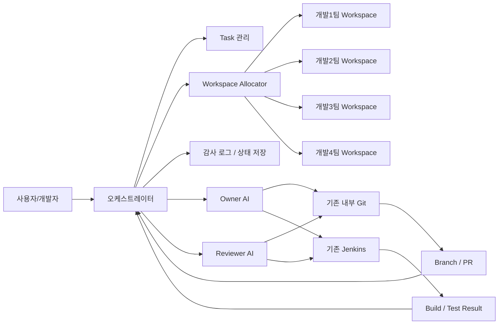
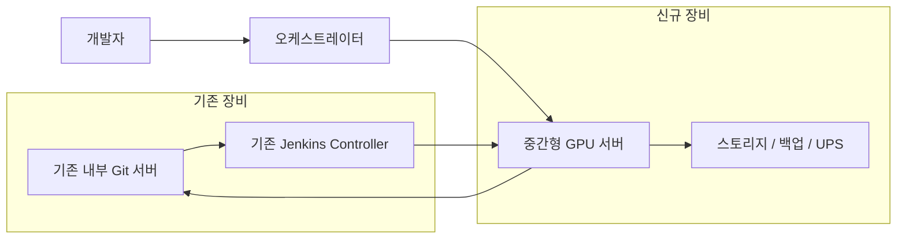
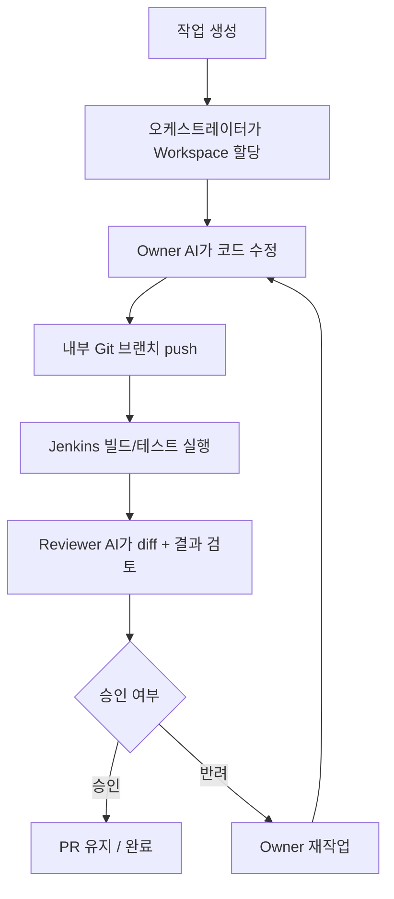
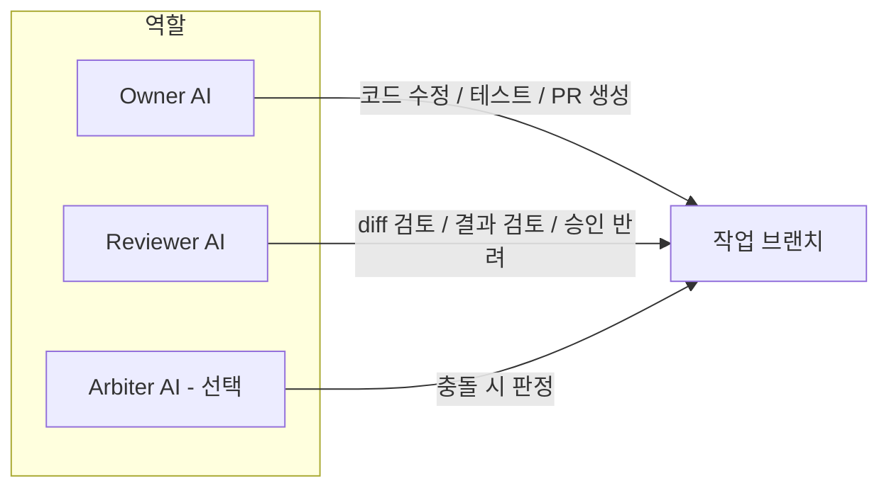

# 사내 폐쇄망 AI 개발지원 시스템 구축 검토안

## 1. 시스템 소개

본 검토안은 사내 폐쇄망 내부에서 동작하는 **AI 기반 개발지원 시스템** 구축 제안입니다.

구성 개념:
- **Owner AI**: 작업 브랜치에서 코드 수정, 테스트 실행, PR 생성 지원
- **Reviewer AI**: 변경사항 검토, 테스트 결과 확인, 승인/반려 판단 지원
- **Orchestrator**: 작업 배정, workspace 할당, 상태 관리, 감사 로그 저장
- **내부 Git / Jenkins 연동**: branch/PR 기준 빌드 및 테스트 자동화

운영 전제:
- 외부망 통신 없음
- 소스 외부 유출 금지
- **기존 Git/Jenkins 장비 재사용**
- 팀별 또는 개인별 workspace 분리 운영
- 구축 작업은 **회사 내부 인력 수행** 전제

---

## 2. 시스템 시각화

### 2-1. 전체 구성도

### 2-2. 권장 인프라 구성

### 2-3. 실제 동작 흐름

### 2-4. 역할 분리 구조

---

## 3. 예상 비용

### 3-1. 초기 장비비(1회, 인건비 제외)

| 항목 | 권장 구성 | 예상 비용 |
|---|---|---:|
| GPU 서버 | 중간형 (RTX 6000 Ada / A6000 / L40S 급, RAM 256GB) | 4,000만 ~ 6,500만원 |
| 스토리지/백업/UPS | NAS, 백업 스토리지, UPS 등 | 300만 ~ 1,200만원 |
| **초기 장비비 합계** | **기존 Git/Jenkins 재사용 기준** | **4,300만 ~ 7,700만원** |

### 3-2. 소프트웨어/라이선스 비용

| 항목 | 비용 | 비고 |
|---|---:|---|
| Jenkins | 0원 | 기존 장비 재사용 / 오픈소스 |
| 내부 Git (Gitea Self-Managed) | 0원 | 기존 장비 재사용 / 오픈소스 |
| 내부 Git (GitLab Self-Managed Free) | 0원부터 | 기존 장비 재사용 가능 |
| 내부 LLM 모델 | 0원부터 | 오픈소스 모델 기준, 반입/운영 비용 별도 |

### 3-3. 월간 운영비

| 구분 | 예상 비용 |
|---|---:|
| 인프라/실비 운영비 | 100만 ~ 220만원/월 |
| 운영관리 시간을 별도 비용으로 제외할 경우 | 50만 ~ 120만원/월 |

### 3-4. 연간 운영비

| 구분 | 예상 비용 |
|---|---:|
| 인프라/실비 운영비 | 1,200만 ~ 2,640만원/년 |
| 운영관리 시간을 별도 비용으로 제외할 경우 | 600만 ~ 1,440만원/년 |

### 3-5. 세부 견적 예시 (중간형 기준)

| 항목 | 수량 | 단가(예상) | 합계(예상) | 비고 |
|---|---:|---:|---:|---|
| GPU 서버 | 1 | 4,000만 ~ 6,500만원 | 4,000만 ~ 6,500만원 | 중간형 GPU 2장 기준 서버/워크스테이션 |
| NAS/백업 스토리지 | 1식 | 200만 ~ 700만원 | 200만 ~ 700만원 | 내부 백업/이력 저장 |
| UPS | 1식 | 100만 ~ 500만원 | 100만 ~ 500만원 | 정전 보호 |
| 네트워크/부대자재 | 1식 | 0만 ~ 0원 | 0원 | 기존 Git/Jenkins 환경 활용 가정 |
| **총합** |  |  | **4,300만 ~ 7,700만원** | 장비비만 산정 |

권장안:
- 50명 이내 회사 기준 **중간형 GPU 서버 1대**가 현실적
- **기존 Git/Jenkins 장비 재사용** 전제 시 비용 효율이 가장 좋음
- 운영 범위는 **저장소 1개, 팀 1개 기준 MVP**로 작게 시작 권장

---

## 4. 구축 방법

### 단계별 구축

#### 1단계: Reviewer 우선 도입
- diff 읽기
- 테스트 실행
- 리뷰 결과 생성

#### 2단계: Owner 기능 추가
- 작업 브랜치 수정
- 테스트 실행
- PR 생성

#### 3단계: 승인/반려 루프 구축
- Owner 작업 -> Reviewer 검토 -> 승인/반려
- 재작업 자동화

#### 4단계: 확대 적용
- 팀별 workspace 분리
- 여러 저장소 확장
- 필요 시 Arbiter AI 도입

---

## 5. 장점

- 외부망 연결 없이 사내망 내부에서만 운용 가능
- 소스 외부 유출 위험 최소화
- 반복적인 코드 리뷰/테스트 확인/브랜치 작업 부담 감소
- branch/PR 기반으로 품질 관리 체계화 가능
- 기존 Git/Jenkins 장비를 그대로 활용할 수 있어 초기 장비비 절감 가능

---

## 6. 단점 및 리스크

- 초기 GPU 장비 비용이 큼
- GPU 및 내부 모델 운영 부담이 발생함
- 상용 SaaS 대비 품질이 낮을 수 있음
- 잘못된 수정/리뷰 결과 가능성 존재
- AI 결과를 사람이 최종 검토해야 함
- 내부 운영 인력이 필요하며, 전담 인력이 없으면 특정 개발자에게 부담이 집중될 수 있음

### 대응 방안
- 초기에는 Reviewer 중심 제한 운영
- main/master 직접 수정 금지
- branch/PR 기준 운영
- Jenkins 결과 없는 완료 금지
- 작업 이력/승인 이력 전부 기록
- 기존 Git/Jenkins는 재사용하고 AI 장비만 신규 도입

---

## 7. 어떻게 사용하는지

1. 개발자가 작업 생성
2. 시스템이 workspace 할당
3. Owner AI가 코드 수정 및 테스트 수행
4. Jenkins가 빌드/테스트 실행
5. Reviewer AI가 결과 검토
6. 승인 시 PR 유지, 반려 시 재작업

즉, 개발자를 대체하는 구조가 아니라  
**개발자의 반복 작업을 줄이고 검토 보조를 제공하는 구조**로 운영합니다.

---

## 8. 필요한 장비

### 최소 권장 장비
- **GPU 서버 1대**
  - 중간형 GPU 장비
  - RAM 256GB 기준
  - 내부 LLM / Owner / Reviewer / 오케스트레이터 / workspace 운영
- **기존 Git/Jenkins 장비 재사용**
- NAS 또는 백업 스토리지
- UPS

### 권장 운영 장비 구성
- **중간형 GPU 서버 1대 + 기존 Git/Jenkins 장비 재사용**
- 팀 1개 / 저장소 1개 MVP 운영 가능 수준
- 운영 안정화 후 필요 시 GPU 서버 추가 증설 검토

### 운영 환경
- 폐쇄망 내부 전용 네트워크
- 팀별 또는 개인별 workspace 운영 환경
- 작업/로그/승인 이력 저장용 서버 또는 DB

---

## 9. PPT 1장 발표용 요약 문구

### 제목
사내 폐쇄망 AI 개발지원 시스템 구축 검토안

### 배경
- 반복적인 코드 리뷰, 테스트 확인, 브랜치 작업 부담 증가
- 외부 SaaS AI는 소스 외부 유출 위험으로 활용 제한
- 폐쇄망 내부에서만 동작하는 AI 개발지원 체계 필요

### 제안 내용
- Owner AI: 코드 수정 / 테스트 / PR 생성 지원
- Reviewer AI: 변경사항 검토 / 승인·반려 판단 지원
- 기존 Git / Jenkins 재사용
- 팀별·개인별 workspace 분리 운영
- **중간형 GPU 서버 1대 신규 도입 권장**

### 기대 효과
- 개발 생산성 향상
- 리뷰 및 테스트 검토 체계화
- 소스 외부 유출 없이 내부망에서만 운용 가능
- 기존 장비 활용으로 초기 투자 부담 완화

### 비용
- 초기 장비비: **4,300만 ~ 7,700만원**
- 월간 운영비: **100만 ~ 220만원**
- 연간 운영비: **1,200만 ~ 2,640만원**

### 제안
- **중간형 GPU 서버 1대 + 기존 Git/Jenkins 재사용**
- **저장소 1개, 팀 1개 기준 MVP**부터 단계 도입 검토
- 안정화 후 확대 적용

### 회의용 한 줄
외부 AI를 쓰자는 것이 아니라, **소스 외부 유출 없이 내부망에서만 동작하는 개발지원 시스템을 기존 Git/Jenkins 장비를 활용하여 중간형 GPU 서버 1대 기준으로 소규모 MVP부터 도입해 보자는 제안**입니다.

---

## 10. 추진 일정표

### 2주 MVP 일정표

| 주차 | 작업 내용 | 산출물 |
|---|---|---|
| 1주차 | GPU 서버 준비, 내부 LLM 준비, 기존 Git/Jenkins 연동, Reviewer 기능 구현 | 리뷰 결과 생성 가능 |
| 2주차 | Owner 기능 추가, branch 작업, PR 생성, 승인/반려 루프 연결 | 저장소 1개 기준 MVP 동작 |

### 4주 확장 일정표

| 주차 | 작업 내용 | 산출물 |
|---|---|---|
| 1주차 | GPU 서버 환경 정리, Git/Jenkins 연동 | 기본 인프라 준비 |
| 2주차 | Reviewer 도입, diff/test 기반 리뷰 | Reviewer MVP |
| 3주차 | Owner 도입, branch 수정/test/push/PR 생성 | Owner MVP |
| 4주차 | workspace allocator, 감사 로그, 운영 화면 정리 | 팀 단위 시범 운영 가능 |

---

## 11. 요청 사항

- 사내 폐쇄망 AI 개발지원 시스템 구축 가능 여부 검토
- **중간형 GPU 서버 1대 기준** 예산 검토
- 저장소 1개 / 팀 1개 기준 MVP 시범 도입 검토
- 기존 Git/Jenkins 장비 재사용 방식 협의
- 운영 주체 지정

---

## 12. AI 모델/배포 방식 비교

| 구분 | 장점 | 단점 | 완전 폐쇄망 적합성 | 권장 용도 |
|---|---|---|---|---|
| **Claude 계열** | 코드 이해/리뷰 품질이 높고 Owner/Reviewer 워크플로우와 궁합이 좋음 | 완전 폐쇄망 직접 설치는 현실적으로 어려우며 Bedrock/Vertex 같은 관리형 경로 필요 | **낮음** | 외부 연계형 또는 관리형 클라우드 환경 |
| **GPT 계열** | 범용 추론, 도구 사용, 코드 생성 품질이 높음 | OpenAI/Azure API 전제가 필요하고 완전 air-gap에는 부적합 | **낮음** | 외부 연계형 또는 프라이빗 클라우드형 |
| **Gemini 계열** | 긴 컨텍스트와 Google 생태계 연동이 강점 | Vertex AI 전제가 강하고 완전 폐쇄망 직접 설치는 어려움 | **낮음** | GCP 기반 외부 연계형 |
| **오픈소스 로컬 모델** | 완전 폐쇄망 내부 설치 가능, 소스 외부 유출 통제에 유리 | 상용 최고급 모델 대비 품질/속도/튜닝 부담이 있음 | **높음** | 방산/폐쇄망 MVP 및 실사용 초기 단계 |

현재 회사 조건(폐쇄망, 소스 외부 유출 금지)을 기준으로 하면, **완전 폐쇄망 MVP는 오픈소스 로컬 모델 기반이 현실적**입니다.

### 권장 판단
- **보안/통제 최우선**: 오픈소스 로컬 모델 + 내부 RAG
- **최고급 모델 품질 최우선**: Claude/GPT/Gemini 관리형 경로 검토
- **완전 폐쇄망과 Claude/GPT/Gemini 최고급 품질을 동시에 만족**시키는 것은 현실적으로 어렵습니다.

---

## 13. 방산 SW 적용 시 첫 번째 성공 사례

방산 SW 환경에서는 범용 코드 생성보다 **규정/정적분석 대응 Reviewer**부터 시작하는 것이 더 현실적입니다.

### 권장 1차 유즈케이스
- 입력: **Sparrow structured finding**
- 출력:
  - 관련 **MISRA / 6016F 조항 근거**
  - 원인 설명
  - 수정 가이드
  - 패치 초안

### 이유
- 자동 수정/자동 push보다 안전함
- 평가 기준이 명확함
- 규정 근거를 같이 제시할 수 있음
- 사람 검토 흐름을 유지할 수 있음
- 사내 규칙과 정적분석 대응 지식을 구조화하기 좋음

### 권장 지식 주입 순서
1. **RAG 우선**
   - 6016F, MISRA, Sparrow 가이드 문서 검색
2. **코드 검색 연동**
   - 관련 모듈/심볼/수정 예시 검색
3. **Fine-tuning은 후순위**
   - 소스 전체 미세조정보다 RAG와 예시 기반 보강이 먼저

---

## 14. "이곳과 동일한 수준" 구축 가능성

현재 이곳과 같은 형태의 **Owner / Reviewer / Orchestrator 워크플로우 자체는 폐쇄망에서도 구축 가능**합니다.

다만 차이는 명확합니다.

### 가능한 것
- 역할 분리형 AI 워크플로우
- 내부 Git / Jenkins 연동
- branch / PR 기반 승인·반려 루프
- 감사 로그 / workspace allocator 구조

### 그대로 재현되기 어려운 것
- Claude / GPT / Gemini 최고급 모델 품질
- 외부 초대형 인프라 기반의 빠른 응답 속도
- 대형 모델 다중 병렬 운용 여유

즉,
- **구조와 운영 방식은 유사하게 구축 가능**
- **모델 품질은 동일 수준을 기대하면 안 됨**
- 따라서 폐쇄망 구축안은 **"같은 구조, 다른 모델"**로 보는 것이 맞습니다.

---

## 15. 결론

당사 환경(폐쇄망, 소스 외부 반출 금지, 소규모 조직)을 고려할 때  
외부 AI 서비스가 아닌 **사내 폐쇄망 기반 AI 개발지원 시스템** 구축은 충분히 검토 가능한 방향입니다.

다만 전사 확대 전에,
- **중간형 GPU 서버 1대**
- **기존 Git/Jenkins 장비 재사용**
- 저장소 1개
- 팀 1개
- Reviewer/Owner 역할 분리
- branch/PR 기반 운영

형태의 **소규모 MVP부터 시작**하는 것이 가장 현실적이고 안전한 방법입니다.

