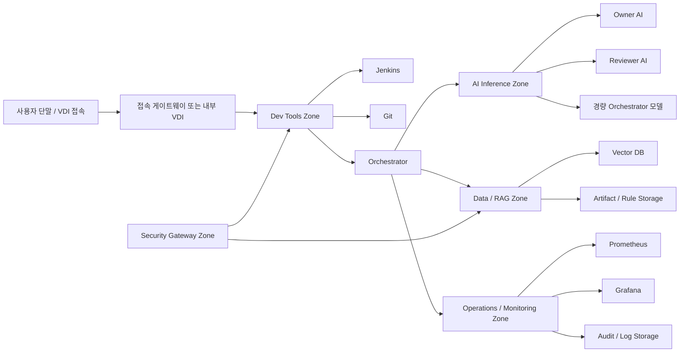

# 사내 AI 구축을 위한 내부망 인프라 설계안

## 1. 문서 목적

본 문서는 사내 AI 개발지원 시스템을 안정적으로 수용하기 위한 **내부망 인프라 설계안**입니다.
동시에, **현재 회사 사무실 망 재구축 시 참고할 수 있는 네트워크 설계 기준서**를 목표로 합니다.

초점은 아래 세 가지입니다.

- **보안 통제**: 코드, 로그, 규칙 문서, 빌드 산출물의 반출 통제
- **운영 확장성**: 추후 AI 모델과 서비스가 늘어나도 구조를 크게 바꾸지 않는 망 설계
- **성능 확보**: 정적 분석 결과, 패치, 빌드 산출물, RAG 인덱스 동기화가 병목 없이 흐르는 내부 네트워크

이 문서는 AI 모델 선택 문서가 아니라, **어떤 AI를 붙이더라도 견딜 수 있는 사내망 골격**을 정의하는 문서입니다.

---

## 2. 먼저 바로잡아야 할 전제

### 2-1. 완전 Air-Gap과 외부망 원격 접속은 동시에 성립하지 않음

아래 두 문장은 같이 둘 수 없습니다.

- `내부망과 외부망 사이 물리적 연결점 없음`
- `외부망 PC에서 내부망 VDI로 직접 접속`

외부망 PC가 내부 VDI에 접속하는 순간, 그것은 **완전 air-gap**이 아니라 **통제형 연결망**입니다.

따라서 사내망 설계는 처음부터 아래 두 가지 중 하나로 명확히 나눠야 합니다.

### 2-2. 선택 가능한 두 가지 접속 모델

| 모델 | 설명 | 적합 상황 |
|---|---|---|
| **완전 격리형 (True Air-Gap)** | 내부망과 외부망 사이 직접 통신 경로 없음 | 절대 반출 금지, 최고 보안 우선 |
| **통제형 내부망 (Controlled Access)** | 승인된 게이트웨이/VDI를 통해 제한된 접속 허용 | 사용성, 운영 편의, 단계적 확장 필요 |

이 문서의 기본 권고는 아래와 같습니다.

- **보안 최우선 조직**: 완전 격리형을 기본값으로 설계
- **실무 운영성과 확장성까지 같이 보려는 조직**: 통제형 내부망을 현실안으로 설계

---

## 3. 설계 목표

### 3-1. 공통 목표

1. **AI 추가가 쉬운 망 구조**
2. **Git / Jenkins / RAG / 모델 서버 간 대역폭 확보**
3. **민감 데이터 흐름의 구역화**
4. **운영 도구와 사용자 접속 경로 분리**
5. **향후 외부 엔터프라이즈 API 연계 시에도 정책 게이트 추가만으로 대응 가능**

### 3-2. 비목표

아래는 이 문서의 직접 범위가 아닙니다.

- 특정 GPU 벤더 발주서
- 최종 모델 선정
- 실제 구매 견적서
- 보안 승인 절차서

---

## 4. 권장 망 구조 개요

### 4-1. 논리적 계층

사내 AI 구축망은 최소한 아래 계층으로 분리하는 것이 좋습니다.

```text
1. User Access Zone
2. Dev Tools Zone
3. AI Inference Zone
4. Data / RAG Zone
5. Operations / Monitoring Zone
6. Security Gateway Zone
```

각 계층을 한 VLAN에 억지로 몰아넣기보다, **서비스 성격에 따라 분리**하는 편이 이후 AI 추가에 유리합니다.

### 4-2. 권장 전체 구성



핵심은 **AI를 직접 바꾸는 대신, AI가 붙는 Zone과 Adapter를 유지**하는 것입니다.

---

## 5. 물리 구성 권장안

### 5-1. 네트워크 백본

기본 전제:

- **서버 존 간 10G 백본**
- **스토리지 / AI 서버 / Jenkins / Git 간 10G 우선**
- 사용자 단말까지는 상황에 따라 1G 또는 2.5G, 거점 구간은 10G uplink

권장 장비 성격:

| 항목 | 권장 수준 | 비고 |
|---|---|---|
| L3 스위치 | 10G SFP+ 지원, VLAN / ACL / QoS 가능 | 코어 스위치 |
| 서버 NIC | Dual-port 10G SFP+ 이상 | 본딩 또는 역할 분리 가능 |
| 케이블 | 서버실 구간 OM4 광, 사용자 구간 Cat.6A 이상 | 구간별 혼합 가능 |
| 방화벽/게이트웨이 | 통제형 내부망일 때만 별도 배치 | 완전 격리형은 미사용 가능 |

### 5-2. 서버 역할군

| 역할군 | 권장 구성 | 용도 |
|---|---|---|
| **AI 추론 서버** | GPU 장착 추론 서버 1~N대 | Owner / Reviewer / 경량 Orchestrator 모델 |
| **Dev Tools 서버** | CPU 중심 서버 | Git, Jenkins, Runner, 내부 패키지 저장소 |
| **RAG / Storage 서버** | NVMe + 대용량 스토리지 | 규칙 카드, benchmark, vector DB, pack 저장 |
| **운영/모니터링 서버** | CPU 중심 서버 | Grafana, Prometheus, 로그 수집 |
| **VDI / Gateway 서버** | 필요 시 별도 | 통제형 내부망 사용자 접속 |

### 5-3. AI 서버 사양은 역할 분리 기준으로 잡을 것

망 설계 문서에서는 모델명을 박기보다 아래 기준으로 쓰는 편이 좋습니다.

- **경량 제어 모델용 노드**
- **코드 생성/패치용 중대형 노드**
- **검토/검증용 중대형 노드**

이렇게 해야 추후:

- Llama 계열
- DeepSeek 계열
- Claude/GPT 외부 API 어댑터
- 신규 오픈웨이트 모델

중 무엇이 붙어도 망 구조를 뜯지 않아도 됩니다.

---

## 6. VLAN / IP 권장 분리

예시:

| VLAN | 이름 | 예시 대역 | 용도 |
|---|---|---|---|
| VLAN 10 | `dev-tools` | `192.168.10.0/24` | Git, Jenkins, artifact repo |
| VLAN 20 | `ai-infra` | `192.168.20.0/24` | Owner, Reviewer, Orchestrator 추론 서버 |
| VLAN 30 | `data-rag` | `192.168.30.0/24` | Vector DB, 규칙 카드 저장소, object storage |
| VLAN 40 | `vdi-user` | `192.168.40.0/24` | VDI 또는 내부 사용자 접속 단말 |
| VLAN 50 | `ops-monitoring` | `192.168.50.0/24` | Prometheus, Grafana, 로그 |
| VLAN 60 | `security-gateway` | `192.168.60.0/24` | 반입/반출 승인 게이트웨이, 프록시, 마스킹 엔진 |
| VLAN 99 | `mgmt-oob` | `192.168.99.0/24` | 스위치/iDRAC/iLO/OOB 관리 |

설계 원칙:

- 사용자 VLAN과 AI 추론 VLAN 직접 통신 최소화
- Git/Jenkins는 사용자 접근과 AI 접근을 모두 받되 ACL로 제한
- Vector DB와 규칙 저장소는 AI 추론 서버에만 직접 허용
- 관리망(OOB)은 일반 업무망과 분리

---

## 7. 사용자 접속 전략

### 7-1. 완전 격리형

권장 방식:

- 내부망 전용 단말 또는 내부 VDI 전용 단말 사용
- 외부망 PC와 동일 장비에서 직접 넘나드는 구조를 피함
- 파일 반입은 승인 게이트웨이 또는 오프라인 절차로만 수행

장점:

- 보안 모델이 가장 단순함
- 설명과 운영이 일치함

단점:

- 사용자 편의성이 낮음
- 운영 현장 적응 비용이 큼

### 7-2. 통제형 내부망

권장 방식:

- VDI 또는 보안 게이트웨이를 통한 접속
- 클립보드, 파일 전송, 인쇄, USB, 화면 캡처 정책 개별 통제
- 원문 코드가 아닌 **작업 환경 자체**를 통제하는 방향

주의:

- 이것은 완전 air-gap이 아님
- 따라서 문서와 보안 설명에서 `완전 폐쇄망`이라는 표현을 남용하면 안 됨

### 7-3. 성능 목표

10G 백본이 있다고 해서 사용자 체감이 무조건 4K 60fps / 15ms가 되지는 않습니다.

현실적인 표현:

- **내부 서버 간 데이터 이동 병목 완화**
- **대형 로그/리포트/아티팩트 동기화 지연 감소**
- **VDI 품질은 클라이언트, 인코더, 네트워크 홉 수, 정책 제한의 영향을 받음**

즉, 10G는 **서버 사이 처리 효율**에는 직접 효과가 크지만, 사용자 체감은 접속 방식과 정책에 따라 달라집니다.

---

## 8. AI 서비스 연결 구조

### 8-1. 추후 AI 추가를 쉽게 하려면

망 설계보다 더 중요한 것은 **AI 연결 지점의 표준화**입니다.

권장 구조:

```text
사용자 / Jenkins / Git 이벤트
-> Orchestrator
-> Model Gateway / Adapter Layer
-> 각 AI 모델 또는 외부 API
```

즉, 네트워크는 아래를 중심으로 설계해야 합니다.

1. **Orchestrator는 고정**
2. **Model Gateway / Adapter Layer를 둠**
3. **모델 교체는 Gateway 뒤에서 처리**

### 8-2. Gateway 계층이 필요한 이유

- 추후 로컬 LLM 추가 시 라우팅 변경이 쉬움
- 외부 엔터프라이즈 API를 병행할 때 정책 삽입이 쉬움
- 요청 로그, 마스킹, 승인 흐름을 한 곳에서 처리 가능
- 벤더별 포맷 차이를 사용자와 Jenkins가 몰라도 됨

### 8-3. 연결 방식 예시

| AI 유형 | 연결 위치 | 비고 |
|---|---|---|
| 로컬 Reviewer 모델 | AI Inference Zone | 완전 내부 처리 |
| 로컬 Owner 모델 | AI Inference Zone | 패치 생성 |
| 외부 엔터프라이즈 API Reviewer | Security Gateway Zone 경유 | 하이브리드 시 사용 |
| 외부 임베딩/API 보조 서비스 | Security Gateway Zone 경유 | 정책상 허용 시만 |

---

## 9. 반입/반출 게이트웨이 설계

추후 추가되는 AI와의 원활한 연결을 위해서도, **데이터 출입구는 한 군데로 몰아야** 합니다.

권장 기능:

- 파일 반입 승인
- 코드/로그 마스킹
- 민감 변수명 치환
- 비밀문서/원문 로그 차단
- 반출 대상 자동 검사
- 감사 로그 저장

반입/반출 정책 예시:

| 항목 | 기본 정책 |
|---|---|
| 원본 저장소 전체 | 외부 전송 금지 |
| 비밀문서 원문 | 외부 전송 금지 |
| 민감 로그 원문 | 외부 전송 금지 |
| 익명화 finding | 조건부 허용 |
| 축약 diff | 조건부 허용 |
| 공개 규칙 질의 | 허용 가능 |

이 구조를 먼저 만들어야, 나중에 **Claude / OpenAI API / Bedrock / Vertex / 신규 로컬 모델**을 붙일 때도 망 정책을 다시 정의하지 않아도 됩니다.

---

## 10. CI/CD와 내부망 연동

권장 흐름:

1. 개발자 push 또는 PR 생성
2. Jenkins 빌드/테스트/Sparrow 수행
3. 결과를 Orchestrator로 전달
4. Orchestrator가 규칙 카드/RAG 조회
5. 필요 시 Owner/Reviewer 모델 호출
6. 결과를 다시 PR 코멘트 또는 리포트로 반환

이때 중요한 것은:

- Jenkins가 직접 각 모델을 부르는 구조보다
- **Jenkins -> Orchestrator -> Model Gateway** 구조가 더 낫다는 점입니다.

이유:

- 모델 교체가 쉬움
- 로컬/외부 경로 혼합 가능
- 감사를 한 곳에서 남길 수 있음

---

## 11. 모니터링 및 운영

최소 운영 항목:

- GPU 온도 / VRAM / 추론 큐 길이
- 10G uplink 사용량
- Jenkins 대기열
- Vector DB 지연
- Gateway 반입/반출 로그
- 사용자 세션 수

권장 도구:

- Prometheus
- Grafana
- 중앙 로그 저장소

운영 문서화가 필요한 항목:

- 모델 버전 관리
- 규칙 카드 반입 이력
- benchmark 업데이트 이력
- 외부 API 정책 변경 이력

---

## 12. 단계별 구축 권장안

### 12-1. 1단계

- 10G 코어 스위치
- Git / Jenkins / RAG / Orchestrator 기본 분리
- AI Inference Zone과 Dev Tools Zone 분리
- 규칙 카드/benchmark 저장 구조 확정

### 12-2. 2단계

- VDI 또는 사용자 접속 통제 구조 정리
- 보안 게이트웨이 도입
- Model Gateway / Adapter Layer 도입
- 로컬 Reviewer 우선 연결

### 12-3. 3단계

- Owner / Reviewer 역할 분리
- 추후 외부 엔터프라이즈 API 연계 또는 추가 로컬 모델 연동
- 운영 로그 / 정책 / 승인 절차 고도화

---

## 13. 면담용 핵심 포인트

이 문서로 보여줘야 하는 핵심은 아래입니다.

1. **AI 모델보다 먼저, 망과 운영 구조를 분리해서 설계했다**
2. **완전 air-gap과 통제형 내부망을 혼동하지 않았다**
3. **추후 모델이 바뀌어도 네트워크 구조를 다시 뜯지 않도록 Gateway 중심 구조를 잡았다**
4. **10G를 단순 홍보 문구가 아니라, 서버 간 I/O 병목 제거 관점에서 설명했다**

---

## 14. 결론

사내 AI 구축에서 네트워크는 단순한 연결 수단이 아니라 **보안 정책과 AI 확장성을 동시에 결정하는 기반 구조**입니다.

따라서 권장 결론은 다음과 같습니다.

- **완전 보안 우선**이면: **완전 격리형 + 내부 전용 단말**
- **실무 운영성과 향후 확장성까지 같이 보려면**: **통제형 내부망 + 10G 백본 + Gateway 중심 구조**

추후 AI가 추가되더라도,

- Orchestrator
- Model Gateway / Adapter Layer
- AI Inference Zone
- Data / RAG Zone
- Security Gateway Zone

이 다섯 축을 유지하면 큰 재설계 없이 수용 가능합니다.
